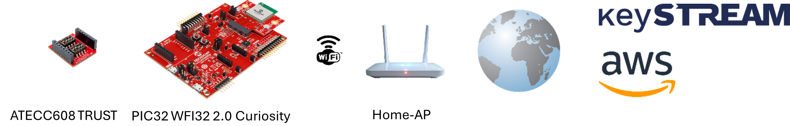
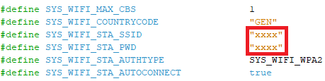
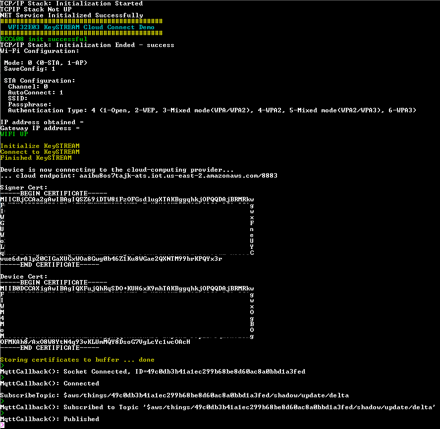
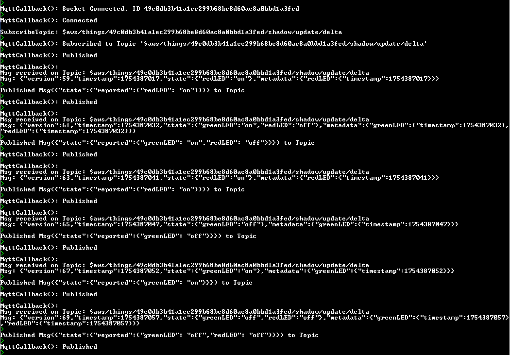

# keySTREAM Provisioning AWS Cloud MQTT Demo <!-- omit in toc -->

> "IoT Made Easy!" - This application demonstrates the in-field provisioning and registration to a cloud-computing provider by means of the ECC608-TMNGTLS CryptoAuthentication&trade; element and Kudelski keySTREAM Trusted Agent (KTA).

Devices: **| WFI32E03 | ECC608-TMNGTLS |** 
Features: **| Wi-Fi |**

## ⚠ Disclaimer <!-- omit in toc -->

<b>
THE SOFTWARE ARE PROVIDED "AS IS" AND GIVE A PATH FOR SELF-SUPPORT AND SELF-MAINTENANCE. This repository contains example code intended to help accelerate client product development.  

For additional Microchip repos, see: <a href="https://github.com/Microchip-MPLAB-Harmony" target="_blank">https://github.com/Microchip-MPLAB-Harmony</a>

Checkout the <a href="https://microchipsupport.force.com/s/" target="_blank">Technical support portal</a> to access our knowledge base, community forums or submit support ticket requests.

</b>

## Contents 

- [Contents](#contents)
- [Introduction](#introduction)
- [Bill of Material](#bill-of-material)
- [Prerequisites](#prerequisites)
- [Hardware Setup](#hardware-setup)
    - [PIC32 WFI32 2.0 Curiosity Board](#pic32-wfi32-20-curiosity-board)
    - [ATECC608 TRUST Board](#atecc608-trust-board)
    - [CryptoAuth TrustMANAGER Board](#cryptoauth-trustmanager-board)
    - [MPLAB® PICkit™ 4 In-Circuit Debugger](#mplab-pickit-4-in-circuit-debugger)
- [Software Setup](#software-setup)
    - [Development Tools](#development-tools)
    - [MCC Content Library](#mcc-content-library)
    - [others](#others)
- [Firmware](#firmware)
- [Run the Demo](#run-the-demo)
- [Links](#links)

## Introduction

This application demonstrates the usage of the WFI32E03 in a Public Key Infrastructure (PKI) based environemnt to ensure secure communication and data protection to Amazon Web Services (AWS). This is achieved by means of Microchip's TrustMANAGER and Kudelski's keySTREAM Trusted Agent (KTA). 
 
The FreeRTOS&trade; based application will host a TCP client in Wi-Fi STA mode connecting to the Home-AP. To ensure proper Wi-Fi connectivity provide the necessary details, see [here](#firmware).  By default, every time the IoT device is powered-up, a TCP client socket connection to Kudelski server will be established either to initially set-up, to confirm or to renew its credentials. Only if the so called in-field provisioning process has been finished successfully, the device is able to establish a secure connection to any cloud-computing provider deploying PKI e.g., Amazon Web Services. 
Subsequent to the provisioning step, the device generates the signer and device certificates and opens a TLS-based TCP client socket to AWS. The required public and private keys used during the protocol handshaking procedure are generated by means of information stored in the TrustMANAGER CryptoAuthentication&trade; secure element. 
Just prior the MQTT based demo is started, the device has to be registered once to AWS. This step is automatically taking place during the very first cloud access. 
In case a successful connection to the MQTT broker has been establisch, the application is subscribing to a specific MQTT-topic, followed by either creating a new or overwriting an existing default device shadow. After that, an internal timer will be started to initiate the LED toggle mechanism. Anytime an LED state change is taking place, a reporting message will be published to the broker and a related change notification must be received from the cloud. 
<b>Note:</b> It is recommented to review the following bullet points on the specific account:
>a) Kudelski 
- <i>My Devices</i>: double-check that the device state is set to "Onboarded"
>b) AWS 
-  <i>IoT Core &rarr; Security &rarr; Policies</i>: double-check that a device related policy has been created
-  <i>IoT Core &rarr; Security &rarr; Certificates</i>: double-check that a device related certificate ID has been created and activated
-  <i>IoT Core &rarr; All devices &rarr; Things</i>: double-check that the device has been registered

[TOP](#contents)

## Bill of Material

| TOOLS | QUANTITY |
| :- | :- |
| [PIC32 WFI32 2.0 Curiosity Board](https://www.microchip.com/en-us/development-tool/EV67T15A) | 1 |
| [ATECC608 TRUST Board Revision: 04-11017-R4 and above](https://www.microchip.com/en-us/development-tool/DT100104) | 1 |
| [CryptoAuth TrustMANAGER Board](https://www.microchip.com/en-us/development-tool/EV10E69A) | 1 |
| [MPLAB® PICkit&trade; 4 In-Circuit Debugger](https://www.microchip.com/en-us/development-tool/PG164140) | 1 |

[TOP](#contents)

## Prerequisites

- Create and sign in to [AWS](https://portal.aws.amazon.com/gp/aws/developer/registration/index.html?nc2=h_ct&src=header_signup) account
- Create and sign in to Kudelski IoT [keySTREAM](https://www.kudelski-iot.com/services-and-systems/microchip) account
- [Download](https://www.microchip.com/en-us/products/security/trust-platform/tpds) and install Microchip Trust Platform Design Suite (TPDS)
- Before utilizing the target hardware platform the ECC608-TMNGTLS CryptoAuthentication&trade; security element (<i>TrustMANAGER</i>) needs to be registered at Kudelski IoT keySTREAM initially. Follow the instructions as described in setting up the [ATECC608 TRUST](#atecc608-trust-board) and [CryptoAuth TrustMANAGER](#cryptoauth-trustmanager-board) board.  Open the Microchip Trust Platform Design Suite and select <i>Usecases</i>.  
  Now select <i>"CryptoAuth Trust Platform - TMNG"</i> in the <i>Kit</i> drop-down box and <i>"keySTREAM&trade; In-field Provisioning"</i> as the <i>Usecase</i>.  
 In the next dialog click the first <i>Pre-Config instruction</i> to generate the Manifest file for the ATECC608 secure element. The second step requires device related information from Kudelski IoT keySTREAM and AWS. Use the <i>Usecase Help</i> button and follow the guidance to create and gather the necessary data. 
  Finish the remaining steps 3 to 6. On success, close TPDS and open the MPLAB X project separately.  Now follow the instructions as described in setting up the [PIC32 WFI32 2.0 Curiosity board](#pic32-wfi32-20-curiosity-board).

[TOP](#contents)

## Hardware Setup
#### <u>PIC32 WFI32 2.0 Curiosity Board</u>

  - Connect the ATECC608 TRUST and PIC32 WFI32 2.0 Curiosity board via mikroBUS&trade; header (J200) 
  
  - For normal operations set the Power Source Selection Jumper (J202) to VBUS-VIN (5-6), if the demo software has been already programmed to the device
  - Connect the Target VBUS Micro-B Connector (J204) on the board to the computer using a micro USB cable
  - On the GPIO Header (J207), connect U1RX (PIN 13) and U1TX (PIN 23) to TX and RX pin of any USB to UART converter. When using FTDI chips, connect GND (PIN 17) additionally.
  - Home AP (Wi-Fi Access Point with internet connection)
  - For device programming, follow the instruction as descibed in setting up the [MPLAB® PICkit&trade; 4 In-Circuit Debugger](#mplab-pickit-4-in-circuit-debugger)

#### <u>ATECC608 TRUST Board</u>

  - To activate the <i>TrustMANAGER</i> secure element of board revision #4 set DIP switch 8 to ON (SW2)
  - To activate the <i>TrustMANAGER</i> secure element of board revision #5 or later set DIP switch 5 to ON (SW2)

#### <u>CryptoAuth TrustMANAGER Board</u>

  - Set DIP switch SW2_1 to ON to enable mikroBUS&trade; header and SW2_2 to OFF to disable the on-board devices
  - Connect the ATECC608 and CryptoAuth TrustMANAGER board via mikroBUS&trade; header
  - Connect the board to the computer using a micro USB cable

#### <u>MPLAB® PICkit&trade; 4 In-Circuit Debugger</u>

  - Set the Power Source Selection Jumper (J202) to PKOB-VIN (3-4)
  - Connect the PKOB3 Micro-B USB connector (J302) on the board to the computer using a micro USB cable
  - Connect the debugger to ISCP&trade; header (J206)
  - Connect the debugger to the computer using a micro USB cable

[TOP](#contents)

## Software Setup
#### <u>Development Tools</u>
  - MPLAB® X IDE v6.20
  - MPLAB® X IDE plug-ins: MPLAB® Code Configurator (MCC) v5.7.1 and above
  - MPLAB® XC32 C/C++ Compiler v4.10
  - MPLAB® Harmony v3
  - Device Pack: PIC32MZ-W_DFP (1.8.326)
	
#### <u>MCC Content Library</u>
|  Harmony v3 Component | version |
| :- | :- |
| bsp | v3.22.0 |
| csp | v3.19.6 |
| core | v3.13.5 |
| paho.mqtt.embedded-c | v1.2.3 |
| keySTREAM_provisioning | v1.0.1 |
| cryptoauthlib | v3.7.5 |
| wolfssl | v5.4.0 |
| wolfMQTT | v1.19.2 |
| net | v3.12.2 |
| crypto | v3.8.2 |
| wireless_wifi | v3.11.1 |
| wireless_system_pic32mzw1_wfi32e01 | v3.9.1 |
| CMSIS_5 | v5.9.0 |
| CMSIS-FreeRTOS | v11.0.1 |

#### <u>others</u>
  - Microchip Trust Platform Design Suite (TPDS)
  - Serial Terminal application like TERA TERM

[TOP](#contents)

## Firmware

This application repository should be cloned/downloaded to perform the following steps.
- Open the local project file <i>pic32mz_w1_curiosity_freertos.X</i> in MPLAB® X IDE.
- The Harmony MCC <i>Project Graph</i>'s below depicts the components utilized in this project. 

 
- For Wi-Fi connectivity: Insert the credentials either by means of selecting the <i>WIFI SERVICE</i> in the MCC Project Graph <b>or</b> editing file <i>configuration.h</i> directly. Make sure the router is connected to the internet. 

 
- Configure the Net service. 

- Configure the ATECC608. 

- Insert the <i>Fleet Profile Public ID</i> as entered during the <i>Create Fleet Profile</i> process. 

- Configure the MQTT service. As SSID enter "aaibu8os7tajk-ats.iot.us-east-2.amazonaws.com" 

- Configure the Core - Crypto Authentication library. 

 
- Configure the wolfCrypt and wolfSSL library. 

- Configure the on-board LEDs. 
 
- Clean and build the project. To run the project, select "Make and program device" button.  
<b>Note:</b> Anytime changing the settings by means of the MCC <i>Project Graph</i> press button <i>Generate</i>, located within the <i>Project Resources</i> window, to apply that changes into the code. Take special care when merging with existing code. 
  
[TOP](#contents)

## Run the Demo

The application prints the following information to the connected terminal. 

 

[TOP](#contents)

## Links

download Microchip [Trusted Platform Design Suite (TPDS)](https://www.microchip.com/en-us/products/security/trust-platform/tpds) 
[Amazon Web Services (AWS)](https://console.aws.amazon.com/console/home?nc2=h_ct&src=header-signin) login 
Kudelski IoT [keySTREAM](https://www.kudelski-iot.com/services-and-systems/microchip) open account  
[TOP](#contents)